# Runbook

> *Disclaimer: this is the publicly available version of a previously internal runbook, some information has been redacted.
> For many of the links, you will need to have or request access.*

*Note: When adding to this runbook, assume the reader is someone who's been woken up from a deep sleep by being paged, and has forgotten all things. Instructions should be super clear and make as few assumptions as possible.*

## Overview

<details>

<summary>Resources</summary>

- [Architecture Design](https://docs.google.com/document/d/1yjtUHCpeKOuaY0HlSNUN5SWzWTrOPlDjZroX4pqJINM)
- [Feeless Onboarding Design](https://docs.google.com/document/d/1wBFX6c1Tu4Dyxrx9JdKhmXPXXaFmVpHmP5bAAzmX6EU/edit#heading=h.5r4nucp80rf6)
- [Initial Proposal](https://docs.google.com/document/d/1MCGqZn2b6gY2Pa9w0CgmPPptolgsZYCMf0m3j3aZGxg)

</details>

### Deployments

- Alfajores
- Mainnet

### Dashboards

- [GCP monitoring: Komenci Relayer](https://console.cloud.google.com/monitoring/dashboards/builder/59209a7d-0f95-46a3-9512-90ebd438fbff?project=celo-testnet-production)
- [Grafana: Komenci Relayers](https://clabs.grafana.net/d/FydkW4Knz/komenci-relayers)
- [Grafana: Komenci Traffic](https://clabs.grafana.net/d/F1njW4F7z/komenci-traffic)

## Recommended steps when an error alert has occurred

- Check [error reporting](#view-errors-in-stackdriver).
- Check the logs.

## Known Scenarios

### Relayers are out of funds

#### Symptoms

- Transactions are being reverted
- Transaction msg.sender has low cUSD or CELO balance
- OutOfQuota at new OdisOutOfQuotaError

#### Fix: Fund the relayers using the fund account

1. **Configure the environment (can skip if done before)**

    ```bash
    cp ./packages/apps/cli/.env.local.example ./packages/apps/cli/.env.local
    ```

    [REDACTED]

    Get Azure access to celo-prod.

    - Get the permissions.
    - Get the `AZURE_CLIENT_SECRET` value.

1. **Use the tools command to fund the relayers manually**

    All commands are run in the root of the [monorepo](https://www.github.com/celo-org/celo-monorepo).

    Check the relayer balance:

    ```bash
    env NETWORK=rc1 yarn cli fund getRelayerBalance
    ```

    Next, check the balance of the fund account:

    ```bash
    env NETWORK=rc1 yarn cli fund getFundBalance
    ```

    Fund the relayers:

    ```bash
    env NETWORK=rc1 yarn cli fund disburse -co 5 -cu 15 -r <RELAYER ADDRESS>
    ```

    Check the balances are updated as you expect:

    ```bash
    env NETWORK=rc1 yarn cli fund getRelayerBalance
    ```

### Relayer Timeout on the `getPhoneNumberIdentifier`

There is a known issue on the ODIS side that's causing the query pepper operation to take more than the timeout configured on relayer operations.
If errors still happen with an alarming rate that can be increased by editing [celo-monorepo/packages/helm-charts/komenci/values.yaml](https://github.com/celo-org/celo-monorepo/blob/master/packages/helm-charts/komenci/values.yaml) in the `onboarding.relayer.rpcTimeoutMs` value, and the clusters deployed.

### High percentage of reverted transactions

First rule out that this is not related to balance issues. This can be done by either:

- Looking at the [Relayer Dashboard](https://console.cloud.google.com/monitoring/dashboards/custom/59209a7d-0f95-46a3-9512-90ebd438fbff?authuser=1&project=celo-testnet-production&timeDomain=1h) for the relayer balance.
- Following the steps in the [funding relayer section](#relayers-are-out-of-funds), but just the `getRelayerBalance` command (hint: you don't need to setup the vault secret for that command).
- Looking at a couple of transactions for the revert reason.

**How to lookup reverted transactions:**

Prerequisite: [Viewing logs in Stackdriver](#viewing-logs-in-stackdriver)

Filter logs by `jsonPayload.status = "Reverted"`.  This will show TxConfirmation events related to reverted transactions.

Now we need to figure out what that transaction contains. In order to do this you can filter by the trace using this button:

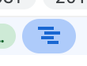

You should now remove the `status = Revert` part of the filter so that it shows all logged events for that trace. There should be one or more `ChildMetaTransactionSubmitted` events where you can see the contract name and method name that is called:

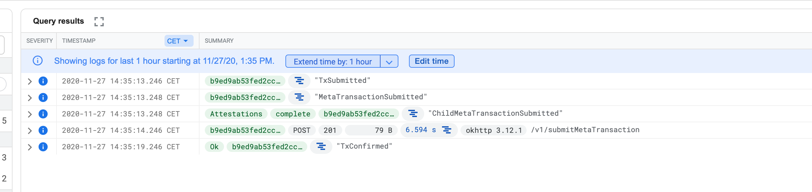

We currently know that we have some issues on the Valora side that are causing `Attestations.complete` meta transactions to fail a certain percentage of the time. If this falls under that, then it can be ignored.

If, however, we're seeing reverts related to other operations then this needs to be escalated.

### `ECONNRESET` or the unhelpful `{ ... }` log-line Error

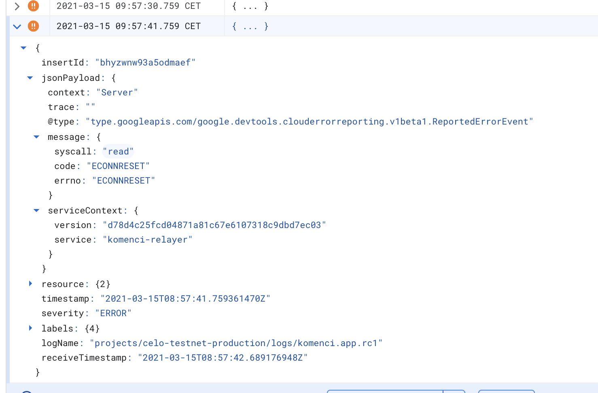

This is an, as of yet, undiagnosed issue that starts plaguing the Relayers. It occurs out-of-band which means that it doesn't seem to interfere directly with the Relayer operations, all RPC calls to the Relayer are usually still successful. But it happens during the relayer's timer-based callbacks that check the status of transactions that were queued.

In order to mitigate this issue we usually just restart the relayer pods in turn and it goes away until it comes back - leading to the assumptions that it's some form of data/memory leaking or a stale connection pool issue.

In order to restart the pods you have to simply connect to the cluster and run:

```bash
kubectl delete pod rc1-relayer-${pod_index} -n rc1
```

Where `pod_index` is `0`, `1`, `2`, `3`, `4`.

Pro Tip: run `kubectl get pods -w -n rc1` in another terminal pane to see updates to the state of the pod. Because of a well known issue with Azure identities, when a pod restarts it might throw `Error` during startup and enter in a `CrashLoopBackOff` states. This is ok, sometimes another restart gets it back in line faster. For best up-time guarantees ensure that a pod was completely restarted and is in `1/1 Running` state before deleting the next pod.

If multiple pods are experiencing this error, you can run this script to restart all of them sequentially:

```bash
#!/bin/bash
relayers=(4 3 2 1 0)
namespace=rc1
for relayer_index in ${relayers[@]}; do
    while :; do 
    kubectl delete pod -n $namespace $namespace-relayer-$relayer_index
    sleep 20
    if kubectl get pods -n $namespace | grep relayer-$relayer_index | grep "1/1"; then
        break
    fi
    done
done
```

### `RelayerCommunicationError: connect EHOSTUNREACH 10.244.x.x:3000`

This issue means that the onboarding service tries to reach relayers pods using obsolete IP addresses. That could happen after rotating the relayer pods if DNS didn't get updated properly. Restarting coredns pods helps.

First, get the list of coredns pods using this command:

```bash
kubectl get pods --namespace=kube-system -l k8s-app=kube-dns
```

Restart them one by one - make sure you use actual pod names returned by the get pods command above:

```bash
kubectl delete pod coredns-xxxxxxxxxx-yyyyy -n kube-system
```

### Unable to pull docker image

The cluster service principal has likely expired. Follow the below instructions to reset the account. Be sure to divert traffic away from the region before rotating the credentials.

Instructions: <https://github.com/celo-org/celo-oracle-old/issues/306>

### Forno rate limiting

#### Symptom

`API rate limit exceeded` in the logs.

#### Escalation

This indicates that Forno rate limiting has been hit. Work with the cLabs blockchain team to check the limits for Komenci.

## How-to Guides: Understanding the State of Things

### Viewing logs in Stackdriver

Go to Stackdriver using this link:
[https://cloudlogging.app.goo.gl/W9gZ3PaFvzYV1jBa7](https://cloudlogging.app.goo.gl/W9gZ3PaFvzYV1jBa7)

It should open up the logs filtered with:

```jsx
resource.type="k8s_container"
log_name="projects/celo-testnet-production/logs/komenci.app.rc1"
```

This gives you a good starting point and you can drill down further using the filters:

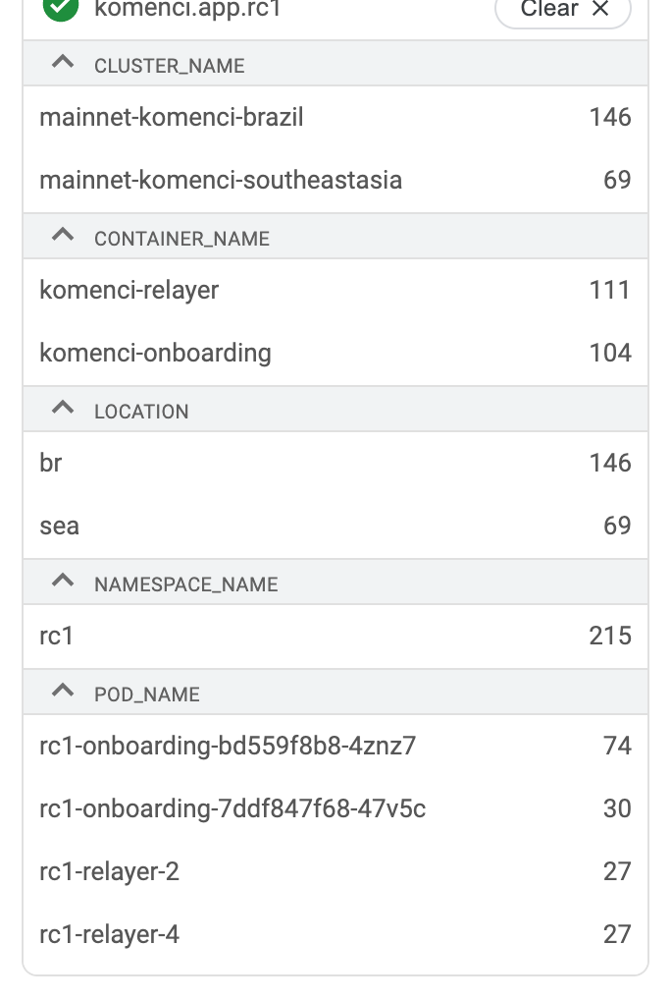

Most logged lines, including errors, have additional metadata in the jsonPayload:

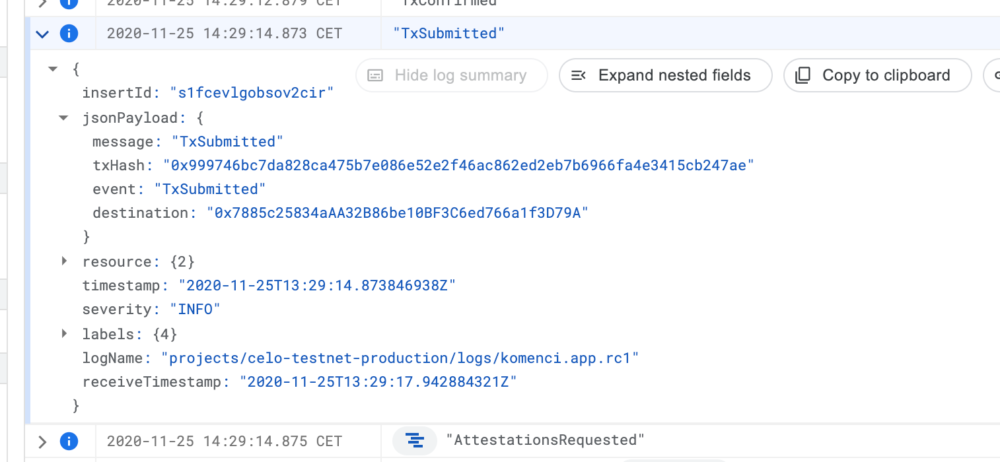

Logs from the API can correlated by using the trace:

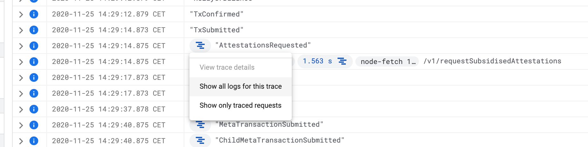

...which will result in showing the logs of a particular request:


This will correlate logs related to a request across services. For example in the above trace, the first and last log lines are from the Relayer, while the middle 3 from the Onboarding API. The last event which is the transaction confirmation actually happens after the request has finished but it's still correlated to that operation!

All API logs share information that's useful to reconstruct the journey of the user, for example "sessionId" and "externalAccount":

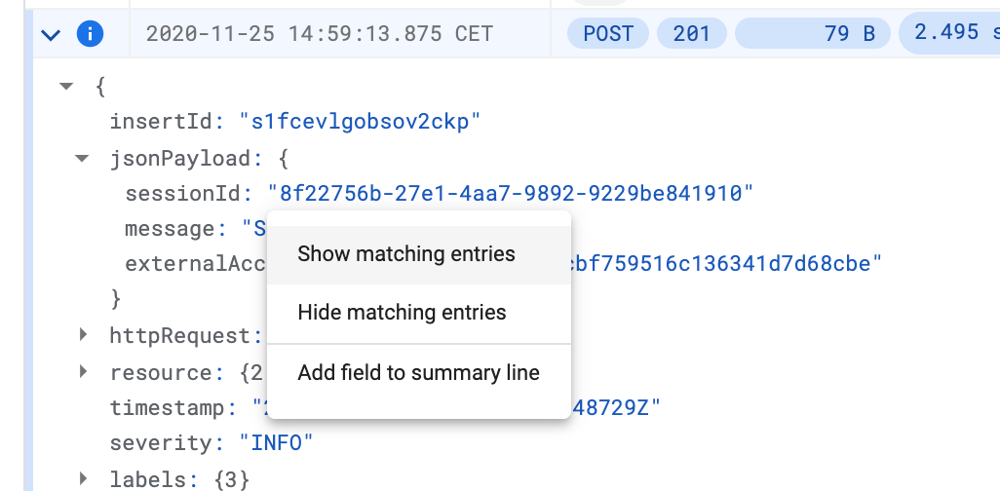

Which makes it easy to see the journey of a session:

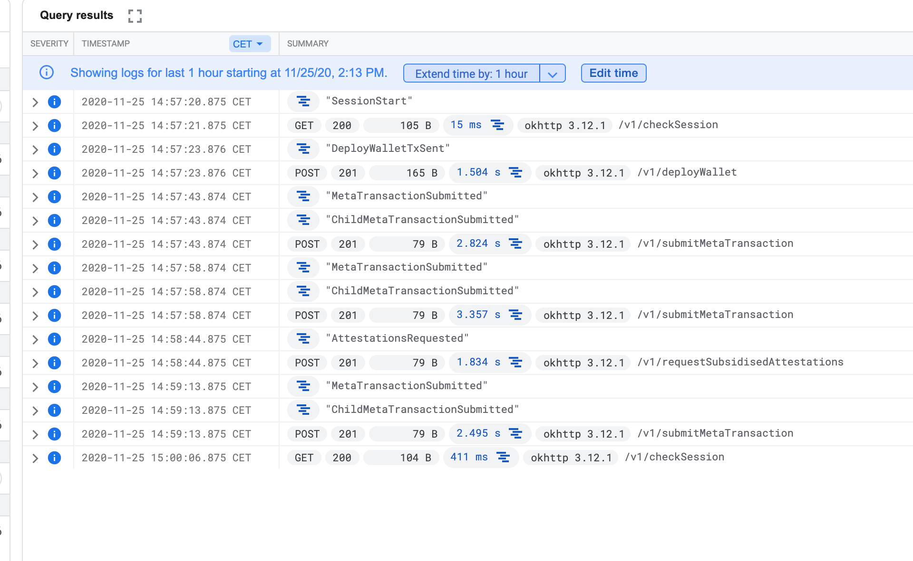

### View errors in Stackdriver

Go to [Error Reporting in Stackdriver](https://console.cloud.google.com/errors?service=komenci-api&time=P1D&order=COUNT_DESC&resolution=OPEN&resolution=ACKNOWLEDGED&project=celo-testnet-production)

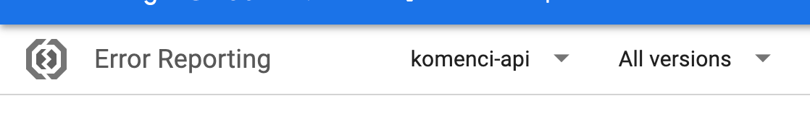

There are 2 services of interest:

- komenci-api
- komenci-relayer

From here the stacktrace of the error can be seen and you can also navigate to the logs which will provider more information and context.

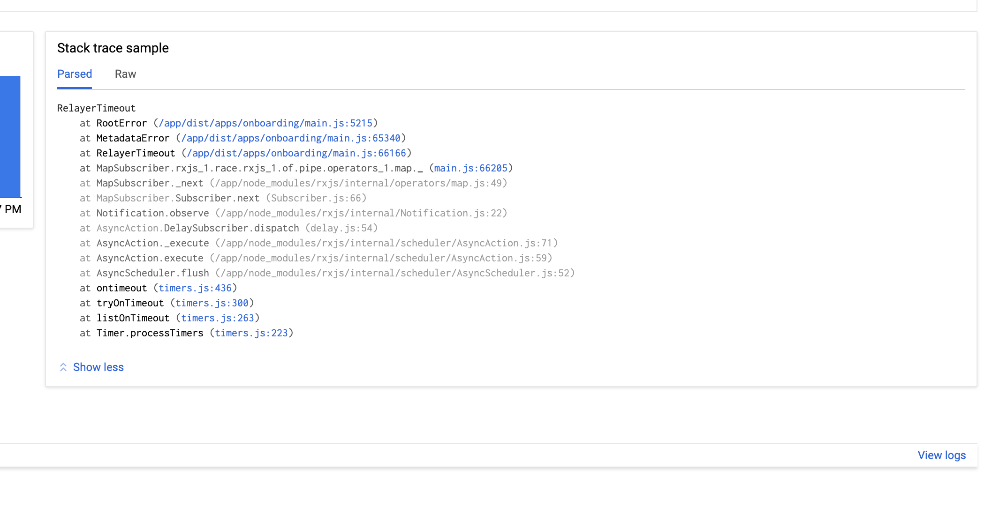

Errors usually have additional metadata associated with them:

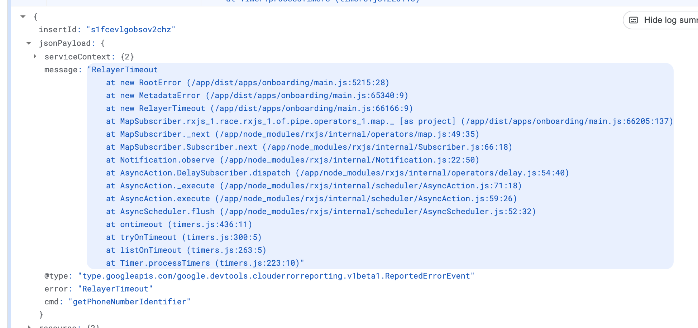

For example the above tells us that the RPC that caused a timeout was running the "getPhoneNumberIdentifier" command on the relayer.
From the logs you can zoom out to the request that triggered the error:

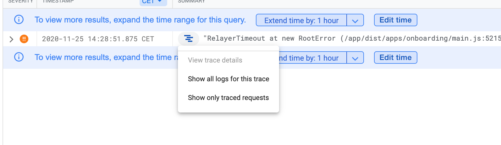

Click on "show all logs for this trace" and then remove the `error group` from the filter:

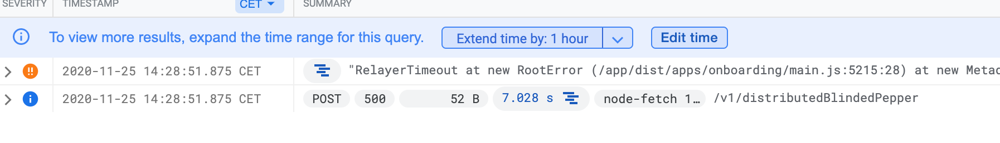

This way the full context can be seen. More info on navigating logs in the logging section.

### Correlating with Valora logs

Currently, the best way to join both sets of logs is on the user address. In Komenci events you can find the user address and use this to correlate. [REDACTED]

### Getting access to Azure [REDACTED]

## How-to Guides: Doing Things

### Deploying a new cluster [REDACTED]

### Upgrading Alfajores Komenci (~30 min)

1. Identify the docker image you'd like to deploy by checking the Github Actions flow

    1. Check the [Deploy to AKS Cluster](https://github.com/celo-org/komenci/actions?query=workflow%3A%22Deploy+to+AKS+Cluster%22) flow and find your build that matches the PR you wish to deploy

    2. Click on the "Build" step
    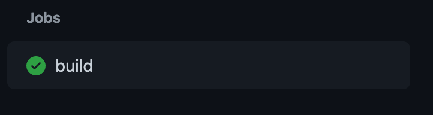

    3. Expand the "Build image" step
    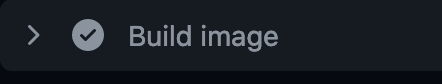

    4. Scroll to the bottom to find the last log line containing the image tag
    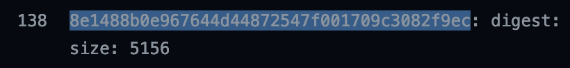

2. Check the Azure Container Registry to make sure the image is present

3. Update the `KOMENCI_DOCKER_IMAGE_TAG` variable with this tag in `.env.alfajores` in your local [monorepo](https://github.com/celo-org/celo-monorepo) branch.

4. Navigate your terminal to `packages/celotool`

5. You may need to get the K8s credentials first if you haven't already.

6. Run the deployment command for each region:

    ```bash
    ./bin/celotooljs.sh deploy upgrade komenci --celo-env alfajores --context azure-komenci-eastus --verbose

    ./bin/celotooljs.sh deploy upgrade komenci --celo-env alfajores --context azure-komenci-westeu --verbose
    ```

7. Check the logs

    1. Use kubectl to check the logs

        ```bash
        kubectl get pods -n alfajores
        kubectl logs -n alfajores <pod name>
        ```

    2. Test the deployment

        1. Enter your phone number in the [attestation-flow.ts script](https://github.com/celo-org/celo-monorepo/blob/fc256b5479892204003eeb5a5c2208598d5395b0/packages/komencikit/examples/attestation-flow.ts#L135)

        2. Go to the monorepo directory: `packages/komencikit/examples/`

        3. Run the script:

            ```node
            npx ts-node attestation-flow.ts alfajores_eus
            
            npx ts-node attestation-flow.ts alfajores_weu
            ```

        4. Monitor for errors in the output

### Upgrading Mainnet Komenci (~30 min)

1. Identify the docker image you'd like to deploy by checking the Github Actions flow

    1. Check the [Deploy to AKS Cluster](https://github.com/celo-org/komenci/actions?query=workflow%3A%22Deploy+to+AKS+Cluster%22) flow and find your build that matches the PR you wish to deploy

    2. Click on the "Build" step

        

    3. Expand the "Build image" step

        

    4. Scroll to the bottom to find the last log line containing the image tag

        

2. Check the Azure Container Registry to make sure the image is present

3. Update the `KOMENCI_DOCKER_IMAGE_TAG` variable with this tag in `.env.rc1` in your local monorepo branch.

4. Navigate your terminal to `packages/celotool`

5. You may need to get the K8s credentials first if you haven't already

6. Get Azure prod access

7. Run the deployment command for each region:

    ```bash
    ./bin/celotooljs.sh deploy upgrade komenci --celo-env rc1 --context azure-komenci-southbr --verbose
    ```

    _Give it some time and [monitor the service for errors](#view-errors-in-stackdriver)._

    ```bash
    ./bin/celotooljs.sh deploy upgrade komenci --celo-env rc1 --context azure-komenci-sea --verbose
    ```

8. Test the deployment

    1. Enter your phone number in the [attestation-flow.ts script](https://github.com/celo-org/celo-monorepo/blob/fc256b5479892204003eeb5a5c2208598d5395b0/packages/komencikit/examples/attestation-flow.ts#L135)

    2. Before running the script, you'll need to solve a real reCAPTCHA since the test hook isn't enabled like it is in Alfajores. We built a simple test site to get a reCAPTCHA token. You can find [instructions here](https://github.com/celo-org/komenci/blob/1f10dad3fe0cca1d46d78d9f79654a7e9f25feba/packages/apps/api/README.md). You'll need to use the Mainnet reCAPTCHA token (which should not be checked in).

    ```node
    npx ts-node attestation-flow.ts alfajores_eus

    npx ts-node attestation-flow.ts alfajores_weu
    ```

### Adding CELO/cUSD to funding account

[REDACTED]

## One-time Setup Guide

### Install AZ CLI

<https://docs.microsoft.com/en-us/cli/azure/>

### Install Helm

<https://helm.sh/docs/intro/install/>

[REDACTED]
